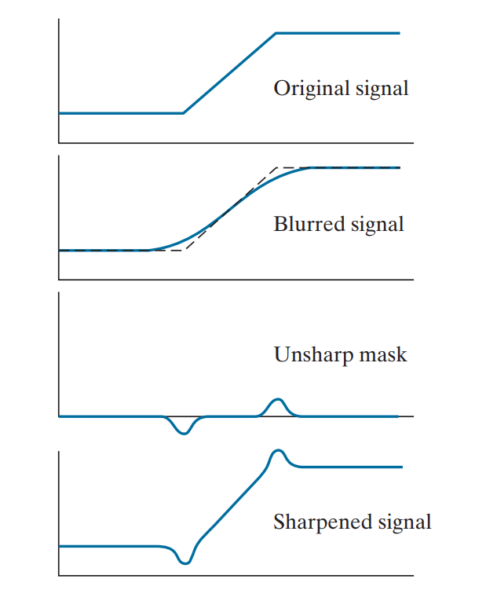

空间滤波器：在输入图像上由一像素及其邻域决定输出图像上像素的值  
种类：高通（高频通过），低通（低频通过），带阻（只有特定频率不通过），带通（只有特定频率通过）  
## 线性滤波器  
T为线性函数  
线性空间滤波器在图像f和空间滤波器核w之间执行加权求和操作  
空间滤波器核又称mask，template，window，简称核  
  
线性空间滤波即空间卷积  
  
有效填充（无填充）：只在有效部分滑动  
相同填充：对于原图像的边缘区域，为避免出现缩小情况，通常会填充0。具体即保证核中心在边缘时填充0可以满足核覆盖区域的计算  
全填充：更极端一点的是要求核的边缘也都能达到图像边缘，此时填充更多0即可  
## 相关&卷积  
  
相关：  
  
$$g(x,y)=\sum^{a}_{s=-a} \sum^{b}_{t=-b}w(s,t)f(x+s,y+t)$$  
  
卷积：  
  
$$g(x,y)=\sum^{a}_{s=-a} \sum^{b}_{t=-b}w(s,t)f(x-s,y-t)$$  
这里$w(s,t)$为核权值，坐标显然是对称的，即一般核边长为奇数  
  
这两个操作相差一个中心对称  
实际进行卷积时，通常是设计好卷积核，预处理中心对称后，进行相关操作，从而等价于直接卷积  
（还有可能出现二者混用的情况）  
  
#### 卷积的可交换  
即滑动的相对性，把公式中核与图像的位置交换不影响卷积结果  
  
  
卷积满足交换率、结合率、分配律  
相关只满足分配律  
  
  
很多时候会连续分层地使用多个卷积核多次卷积，由于满足交换律，可以合并这些卷积核  
此处合并操作是在各个卷积核之间做全填充地卷积  
  
## 单元脉冲  
只有单像素为1，其余为0的图像。  
核与单元脉冲做相关，输出结果中会呈现核的中心对称效果  
（一种预处理核的方法）  
例如  
  
$$\begin{pmatrix} 0 & 0&0&0&0 \\ 0 & 0&0&0&0 \\0 & 0&1&0&0 \\0 & 0&0&0&0 \\0 & 0&0&0&0 \end{pmatrix}$$  
和核  

$$\begin{pmatrix} a&b\\c&d \end{pmatrix}$$  
做相关运算，得到的是  

$$\begin{pmatrix} 0&0&0&0 \\0&d&c&0 \\0&b&a&0 \\0&0&0&0\end{pmatrix}$$  
  
  
  
## 可分离滤波核  
#### 可分离  
将二维核（一个二维矩阵）写成两个向量的外积，从而灵活计算  
  
核可分离等价于秩为1  
具体计算分离方法略  
#### 分离的意义  
分离前，$m*n$的核，直接对k像素的图像卷积，要计算$m*n*k$次乘法以及$(m*n-1)*k$次加法  
分离后，改为$m*1$和$1*n$的两个一维核，先后对图像卷积，乘法变为次，加法相应减少  
参数量巨大时加速效果明显  
一般计算时间优势比只考虑乘法计算次数，即$C=\frac{mn}{m+n}$  
  
## 一些构造核的思路  
一种方法是基于基于数学性质的公式化过滤器。例如计算邻域平均值（模糊），计算局部导数（锐化），主要是简单操作  
  
第二种方法是对一个已有二维空间上的函数采样得到离散的核，或从频域滤波器反推（逆傅里叶），适用于已有数学模型的情况  
  
第三种方法是设计具有特定频率响应的空间滤波器。  
  
## 低通滤波器  
又称平滑滤波器/平均滤波器  
常用于降噪等，也可以是其他滤波器的基础形式（参考“由低通构造……”一节）  
方框（盒式）滤波器、高斯滤波器均为可分离滤波器  
#### 方框滤波器  
即基本、均匀的，各行列相同且归一化的，秩为1 的滤波器，效果是简单的模糊  
  
#### 低通高斯滤波器  
高斯核是唯一可分离的圆对称核，因而计算上具有盒式的优点  
圆对称显然函数参数只有到中心的距离  
核可以写成  
  
$$G(r) = Ke^{-\frac{r^2}{2\sigma^2}}$$  
采样后得到  
  
$$w(s,t) = G(s,t) = Ke^{-\frac{s^2 + t^2}{2\sigma^2}}$$  
  
盒式在平滑图像时，突变边缘变化较生硬，而同样情况高斯则更平滑  
  
  
## 顺序统计滤波器  
是一种非线性滤波器，其中常见有中值滤波器  
后续章节详细讨论  
  
## 高通滤波器  
即锐化滤波器  
考虑平滑滤波操作类似于积分，反之锐化则是求导  
  
#### 基础  
有基于一阶导/二阶导等等的  
这些基于导数的滤波器自然需要先满足对应导数存在的条件，不详述  
  
#### 一阶导  
基本形式为  

$$\frac{\partial f}{\partial x} = f(x+1) - f(x)$$  
采用偏导记号是出于在二维图像上单维的导数是偏导的考虑  
  
#### 二阶导  
基本形式为  

$$\frac{\partial^2 f}{\partial x^2} = f(x+1) + f(x-1) - 2f(x)$$  
考虑一阶导实际计算时两个方向需要不同的模板，还需要梯度等，而二阶导仅用单模板卷积且只找零交叉点而不计算梯度，实际二阶导计算操作少于一阶导  
另外二阶导的锐化效果更好，综上一般使用二阶导  
二阶导对噪声通常比一阶导更加敏感  
  
#### 拉普拉斯算子  
我们希望核是各向同性的，而最简单的各向同性核是拉普拉斯算子  
上述二阶导与一阶导比较中，二阶导参考的也是拉普拉斯算子  
下面讨论该算子  
  
算子的形式为  

$$\nabla^2 f = \frac{\partial^2 f}{\partial x^2} + \frac{\partial^2 f}{\partial y^2}$$  
离散形式下，x和y分别为  

$$\frac{\partial^2 f}{\partial x^2} = f(x+1, y) + f(x-1, y) - 2f(x, y)$$  

$$\frac{\partial^2 f}{\partial y^2} = f(x, y+1) + f(x, y-1) - 2f(x, y)$$  
而合起来的离散拉普拉斯算子即二者之和：  

$$\nabla^2 f(x, y) = f(x+1, y) + f(x-1, y) + f(x, y+1) + f(x, y-1) - 4f(x, y)$$  
注意，**对核整体取反改变符号时，其提取特征的功能并不会改变（这个是靠差值），等价于对输出图像取反，输出图像参与其他步骤运算注意符号即可**  
  
这个与平均核的区别，直观上就是周围与中心像素的权重不同，从而实现锐化、边缘提取  
它突出了尖锐的变化并淡化了平缓的变化，表现为提取出图像中的各种边缘线，即提取细节  
由此我们常对原始图像加/减拉普拉斯图像（取决于图像的符号）  
  
#### 非锐化遮蔽和高频增强滤波（unsharp masking and highboost filtering）  
拉普拉斯图像增强了边缘变化区域，原图叠加上拉普拉斯图像可以突出边缘  
而另一种突出边缘的方式是原图减去非锐化的区域，即非锐化遮蔽  
  
非锐化遮蔽三步：  
模糊原图：得到$\bar{f}(x, y)$  
原图与模糊图做差得到mask：$g_{\text{mask}}(x, y) = f(x, y) - \bar{f}(x, y)$  
原图加上带权重k的mask：$g(x, y) = f(x, y) + k g_{\text{mask}}(x, y)$  
k=1时即非锐化遮蔽unsharp mask  
k>1时即高频增强滤波highboost filter  
  
注意：mask中包含了原图中的上升/下降的变化，在mask中表现为正/负值；因而k过大或原图值较小（比如0值）时，第三步叠加后会产生负值，表现为输出图像中边缘旁出现阴影暗晕（halos）  
#### 梯度  
梯度，即一阶导，这里仅讨论梯度用于锐化  
  
$$\nabla f \equiv \text{grad}(f) = \begin{bmatrix} g_x \\ g_y \end{bmatrix} = \begin{bmatrix} \frac{\partial f}{\partial x} \\ \frac{\partial f}{\partial y} \end{bmatrix}$$  
即在不同方向上的导数组成梯度，  
梯度向量的大小magnitude可以使用L1或L2范数，即  
  
$$M(x, y) \approx |g_x| + |g_y|$$  
  
$$M(x, y) = \|\nabla f\| = \text{mag}(\nabla f) = \sqrt{g_x^2 + g_y^2} $$  
反映了梯度方向上的变化率大小  
$M(x,y)$为每个点处分别求梯度后的集合，即一张梯度图  
  
一般来说L2的各向同性更好，表示模长也更合理，但是L1计算方便，且实际情况中L1和L2都不能在任意角度实现各向同性。所以建议选用L1计算  
  
**离散近似**  
Roberts:   
$g_x = z_9 - z_5, g_y = z_8 - z_6$  
对角差分，  
  
Sobel:  
$g_x = (z_7+2z_8+z_9) - (z_1+2z_2+z_3), g_y = (z_3+2z_6+z_9) - (z_1+2z_4+z_7)$  
加权平滑，抑噪效果好，各向同性相对较优，有对称性  
  
简易差分:   
$g_x = z_8 - z_5, g_y = z_6 - z_5$  
无对称性，噪声敏感  
  
  
  
## 由低通滤波器构造高通、带阻和带通滤波器  
  
单位脉冲减去低通得到高通  
低通叠加高通可以得到带阻  
单位脉冲减去带阻得到带通  
（画图易得）  
  
## 空间增强方法的组合应用  
以下为组合处理方法的举例说明  
  
二阶导对噪声通常比一阶导更加敏感  
使用拉普拉斯算子时，直接使用可能导致原图平坦区域较多噪声。  
可以使用平滑梯度先处理一次，即突出边缘区域，平滑平坦区域，减少来自非边缘区域的噪声，然后使用拉普拉斯算子  
另外梯度类似于提高对比度，而拉普拉斯类似锐化  
  
使用完滤波器锐化图像边缘后，视情况调整图像整体的强度水平  
使用3。1强度变换中的幂律变换（伽马校正）或者直方图变换  
如果图像中同时有大量暗区和亮区，则使用伽马校正局部调整，如果整体亮区/暗区则可以使用直方图变换  