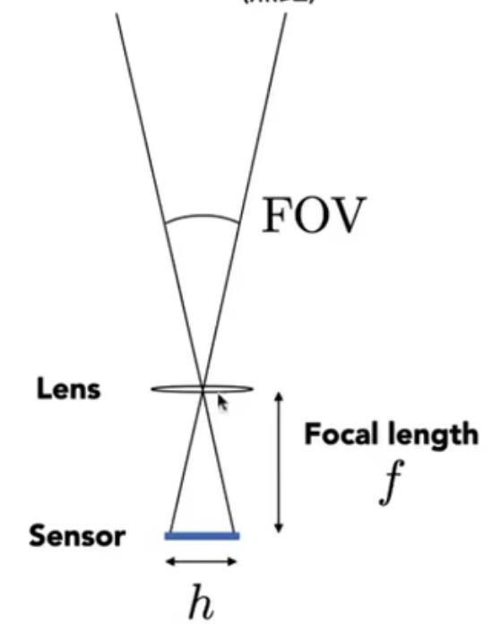

## Field of View (FOV)视场  
  
f在此称为焦距  
h即传感器/胶片大小  
一般默认h为35mm然后用焦距代表视场大小  
  
## 曝光exposure  

$$  
\begin{gathered}  
H = T \times E \\  
exposure =  time \times irradiance  
  
\end{gathered}  
$$  
时间、光圈大小、感光度iso  
光圈大小相当于决定了透镜的大小，但是可以不需要改变透镜的焦距  
  
  
## 运动模糊  
  
  
## thin lens approximation  
理想薄棱镜，具有标准凸透镜性质  
焦距的倒数等于相距和物距的倒数之和  
  
  
## defocus blur  
  
- circle of confusion  coc  
	成像点不在投影面上，光线继续延伸形成圆形模糊  
	与光圈大小有关，形成景深  
  
  
## 景深 depth of field   
coc足够小的一段区域  