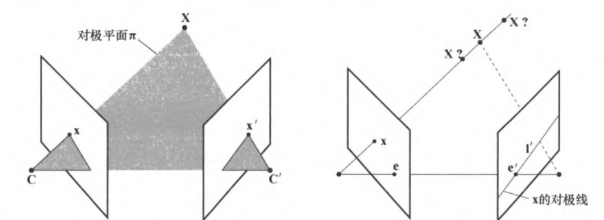

对应几何问题：同一点在不同视图中的像点的关系  
  
  
## 对极几何  
基线：两摄像机中心连线   
对极点：基线交像平面的点，也即两摄像机中心在对方像平面上的像 e和e'  
对极平面：两中心与三维点所共的面  
对极线：对极平面交像平面的线 l和l'  
  
有像平面$\pi_1$和$\pi_2$  
$\pi_1$上像点x在$\pi_2$上对应像点x'，  
$\pi_2$上的对极线为l'  
则x'一定在l'上  
（由定义的共面、交线等显然）  
  
考虑l'为对极点e'与像点x'连线，中心不变时，则有像点x到对极线l'的映射：  
  
$$\mathbf{x} \to \mathbf{l'}$$  
  
  
#### 对极线性质  
在两幅图像中，若有一对对应的对极线，记为$l=F^Tx'$和$l'=Fx$  
已知对极线为像点和对极点连线，则$l$上任取一点可以表示为$p=x+\lambda e$  
$Fp=F(x+\lambda e)=Fx+\lambda Fe=Fx=l'$  
因此$l$上任取一点p都有$Fp=l'$  
又因$l'$上任取一点$p'$都有$p'^Tl'=0$  
则代入得到$p'^T Fp=0$  
综上，一对对极线上各任取一点得到的一对点均满足对极关系  
  
  
  
  
## 基本矩阵  
基本矩阵F是对极几何的代数形式，$F = [e']_\times H_\pi=[e']_\times P'P^+$，3\*3，秩2  
#### 几何推导  
对应像点间的映射:  
$\mathbf{x} \leftrightarrow \mathbf{X} \leftrightarrow \mathbf{x'}$，相互为射影映射关系，则$\mathbf{x} \leftrightarrow \mathbf{x'}$也是相差射影变换，即$\mathbf{x'}=H_\pi \mathbf{x}$  
考虑两摄像机矩阵为P和P‘，P矩阵伪逆为$P^+$  
则有$\mathbf{x'}=P' \mathbf{X}=P' P^+ \mathbf{x}$  
则$H_\pi=P'P^+$  
  
基本矩阵：  
也即像点x到对极线l'的映射  
l'为对极点e'与像点x'连线，即$l' = e' \times x' = [e']_\times x'= [e']_\times H_\pi x = Fx$  
$F = [e']_\times H_\pi=[e']_\times P'P^+$即为基本矩阵  
#### 代数推导  
由第6章有像点x经摄像机矩阵反向投影射线的解：$X(\lambda) = P^+ x + \lambda C$  
第二幅图的对极线由第一个摄像机光心$C$的像$P'C$和反向投影射线上一点$P^+ x$的像$P'P^+ x$相连得到  
即$l' = (P'C) \times (P'P^+ x)=Fx$  
则$F = [P'C]_\times P'P^+ =[e']_\times P'P^+$  
对于已标定摄像机，若有$P = K[I|0] \quad P' = K'[R|t]$ ，则  
  
$$P^+ = \begin{bmatrix}K^{-1} \\0^T\end{bmatrix} \quad C = \begin{pmatrix}0 \\1\end{pmatrix}$$  
  
$$F = [P'C]_\times P'P^+= [K't]_\times K'RK^{-1} = K'^{-T}[t]_\times RK^{-1} = K'^{-T}R[R^T t]_\times K^{-1} = K'^{-T}RK^T[KR^T t]_\times$$  
而两个对极点为  
  
$$e = P \begin{pmatrix}-R^T t \\1\end{pmatrix} = KR^T t \quad e' = P' \begin{pmatrix}0 \\1\end{pmatrix} = K't$$  
因此有  
  
$$F = [e']_\times K'RK^{-1} = K'^{-T}RK^T[e]_\times$$  
#### 性质  
对应点：  
$l' =Fx$，故对任意$l'$上的点$x'$有  
  
$$\mathbf{x'}^TF\mathbf{x}=0$$  
且是唯一满足的矩阵  
  
对应对极线：  
任意不过e且与l相交的直线k，有$l' = F[k]_\times l$  
同理有$l = F^T[k']_\times l'$  
点e同值的直线e显然不过e，则有$l' = F[e]_\times l, \quad l = F^T[e']_\times l'$  
  
3\*3，秩2  
7dof(3\*3本身8dof，不满秩->def=0->1个约束)  
  
$F$为摄像机对$(P,P')$ 的基本矩阵，则$F^T$为反序对$(P',P)$的基本矩阵  
对P与P'作相同射影变换H，摄像机对$(HP,HP')$的基本矩阵仍为F  
  
所有l'过e’，即对任意x有$e'^T (Fx) = (e'^T F)x = 0$，则$e'^T F = 0$  
同理有$Fe = 0$，$F^Te' = 0$，$eF^T = 0$  
  
  
  
  
## 摄像机运动与基本矩阵  
考虑不同视图可以视为摄像机在移动  
  
#### 纯平移  
设摄像机作平移$\mathbf{t}$  
  
等价于世界坐标系作$-\mathbf{t}$的移动  
即运动前后对应点连线平行于$\mathbf{t}$，映射到像平面的消影点即为对极点  
  
纯平移时，设摄像机矩阵为  
$P = K[I|0]$ 和 $P' = K[I|t]$，代入得到$F =[e']_\times$  
  
$x^T l'=x^T Fx=x^T [e]_\times x = 0$，即x在x的对极线上，即自对极成立。对偶同理。  
  
#### 一般运动  
两台摄像机拍同一个物体，可以通过矫正内参、旋转，转化为纯平移运动。  
  
#### 纯平面运动  
旋转加平移，但是旋转轴与平移方向正交，使得运动在平面上完成  
加入约束F对称部分$F_S$不满秩，使得F的自由度减少至6dof  
（我暂时看不懂为什么要单独强调一下这种运动）  
  
## 基本矩阵的几何表示  
#todo 暂跳过，在19章自标定有用(?)  
  
## 由F恢复摄像机矩阵  
#### 由P到F  
对于摄像机对$(P,P')$，总可以取$P = [I \mid 0]$ 和 $P' = [M \mid m]$  
此时基本矩阵F为$[m]_\times M$  
  
  
#### F与P的相关性  
由上文基本矩阵的性质，相差一个射影变换的摄像机对的基本矩阵相同  
而对于一个确定的基本矩阵，其定义的摄像机对有且仅有的多义性就是一个射影变换  
（唯一性通过数学证明）  
  
#### 由F到P  
一个非零矩阵 $F$ 是对应于一对摄像机矩阵 $P$ 和 $P'$ 的基本矩阵的充要条件是 $P'^T FP$ 是反对称矩阵  
  
已知基本矩阵F，若有反对称矩阵S，则可以得到一组摄像机对为$P = [I|0]$和$P' = [SF|e']$  
若$S = [e']_\times$，且$e'^T e' = 0$，则一组选择为$P = [I|0]$ 和 $P' = [[e']_\times F | e']$，此时的P‘中心在无穷远平面上  
  
对应于基本矩阵 $F$，一对规范形式下的摄像机矩阵的一般公式是  
  
$$P = [I|0] \quad P' = [[e']_\times F + e'V^T | \lambda e'] $$  
式中，$V$ 是任意 3 维向量，$\lambda$ 是一个非零标量。  
  
## 本质矩阵  
#### 定义  
归一化坐标下的特殊基本矩阵  
归一化：去除标定矩阵的影响  
即$E = K'^T F K$  
  
归一化摄像机矩阵对的基本矩阵即为本质矩阵  
考虑$P = [I|0]$ 和 $P' = [R|t]$，本质矩阵为$E = [t]_\times R = R[R^T t]_\times$  
#### 性质  
具有基本矩阵的各种性质  
  
5dof（R 3dof+t 3dof，相差一个尺度）  
  
比基本矩阵多的约束：  
$3 \times 3$ 矩阵是本质矩阵的充要条件是它的奇异值中有两个相等而第三个是 0  
  
#### 求E  
利用$\mathbf{x'}^TF\mathbf{x}=0$约束求解E  
或者利用F，由$E = K'^T F K$求E  
  
## 由E恢复摄像机矩阵  
#### E与P的相关性  
SVD分解E，由E的奇异值的特性有  
$$E=U\Sigma V^T=  
\left[\begin{matrix}u_1& u_2 & u_3\end{matrix}\right]\left[\begin{matrix}1 & & \\ & 1 & \\ & & 0\end{matrix}\right]\left[\begin{matrix}v_1^T\\ v_2^T \\v_3^T\end{matrix}\right]$$  
记绕z轴旋转90度的旋转矩阵为  
   
$$\begin{gathered}W = \begin{bmatrix}0 & -1 & 0 \\1 & 0 & 0 \\0 & 0 & 1\end{bmatrix}\end{gathered}$$  
  
假定第一个归一化摄像机矩阵为$P = [I|0]$时  
第二个归一化摄像机矩阵$P = [R|t]$有四种情况  
$P' = [UWV^T | + u_3] \text{ 或 } [UWV^T | - u_3] \text{ 或 } [UW^T V^T | + u_3] \text{ 或 } [UW^T V^T | - u_3]$  
P'四个解中只有一个满足物体同时在P和P'前，因此取一点验证即可确定  