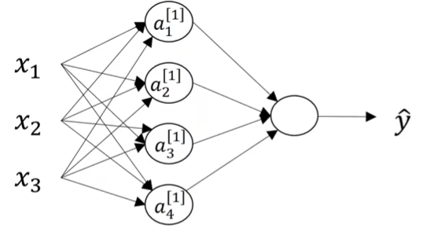

## 符号表示  
使用上角标"\[i]"表示该量是第几层的量  
引入隐藏层之后就可以把初始的输入x写成$a^{[0]}$  
同理，为了统一，将单样本特征数$n_x$记为$n^{[0]}$，隐藏层以及输出层依次记为$n^{[i]}$  
n层NN一般指隐藏层加输出层数，不包括输入  
  
  
## 形式和计算  
  
  
以单样本2层logisitic神经网络为例，隐藏层的每个节点都有一个向量w和值b参数  
参考之前无隐藏层的神经网络计算方法  
从x到任何一个a都有$z^{[1]}_i= w^{[1]T}_i x+b^{[1]}_i$，$a^{[1]}_i=\sigma(z^{[1]}_i)$，$i=1,2,3……,n$  
可以看见，对于每个样本，依然只产出一个预测值，从而与标准进行求差  
## 向量化  
显然上述过程对于x和a都是循环，可以向量化压缩  
我们需要的向量化后的公式形式为$z=Wx+b$，  
x为$n_x$维列向量时，z和b显然是$n_x$维列向量。而这样一来W就得是$w^{[1]T}_i$的堆叠，即一行是一组w参数，即$n*n_x=n^{[1]}*n^{[0]}$矩阵（即下一层\*上一层）。此即W的向量化  
  
而当样本有多个时，参考上一节logistic的多组样本向量化，$x^(i)$样本按列堆叠变为$n_x*m$的矩阵X  
此时公式即为$Z=WX+B$，B为b自填充的相应大小矩阵  
量/结果/计算值等，类似Z和X等，采用相同的堆叠方式（通常是列堆叠），而与之相乘的参数采用另一个方向的堆叠  
  
## 激活函数选择  
除了之前的sigmoid函数，还可以选择其他激活函数。不同层的输出时的激活函数可以不一样，在激活函数$g(x)$上做方括号上标  
  
#### tanh函数  
  
$$a=\tanh(z)=\frac{e^z-e^{-z}}{e^z+e^{-z}}$$  
  
$$\frac{da}{dz}=1-(\tanh(z))^2$$  
相当于sigmoid函数放大后对称点平移至原点处，从而区间由0~1变为-1~1，具有更好的中心化效果。  
通常来说在隐藏层优于sigmoid，sigmoid更适合特定要求结果范围的地方，例如二分分类的输出层  
  
#### ReLU函数  
即线性修正单元，函数为$a=max(0,z)$  
由于其在z大于0时导数值恒为1，避免了梯度受z大小影响变得极其小从而难以收敛的情况，有利于提高训练速度  
是一种很通用的隐藏层激活函数  
  
  
#### leaky ReLU  
相对于ReLU，这个函数把ReLU的负数轴部分变成一个略偏离负半轴的直线，例如$a=max(0.01z,z)$  
  
  
根据实际选所需，可以先行试验  
  
   
如果取消激活函数这一步，或者说使用恒等激活函数，则可以展开多层隐藏层计算后得到一个$a=W'x+b'$的形式，即线性函数的复合仍然是线性函数，形式固定，相当于隐藏层没做  
（ReLU虽然有一半和线性函数图像一样，但是仍然不是完全的线性函数，所以可以正常适用于激活函数）  
  
特殊情况是回归问题可以使用恒等激活函数  
  
## 梯度下降  
将多层隐藏层视为复合函数  
现在的成本函数J是计算输出层，即最后的$a^{[n]}$与标准值y的差值。之后是和上一节一样的，对多样本求和，公式也基本一样  
上述例子中，  
  
$$J = - \frac{1}{m} \sum\limits_{i = 0}^{m} \large\left(\small y^{(i)}\log\left(a^{[2] (i)}\right) + (1-y^{(i)})\log\left(1- a^{[2] (i)}\right)  \large  \right) \small \tag{6}$$  
步骤仍然是正向求预测值，然后逆向求梯度并更新参数  
  
梯度推导方法即复合函数求导  
假如把z视为函数，w和b为参数，则2层神经网络有$$A=g^{[2]}(z^{[2]}(g^{[1]}(z^{[1]}(X))))$$  
相应的代入J中，对各层各个w和b依次求导  
logistic示例流程：  
  
$$  
\begin{gathered}  
dz^{[2]} &= a^{[2]} - y \\  
dW^{[2]} &= dz^{[2]}a^{[1]T} \\  
db^{[2]} &= dz^{[2]} \\  
dz^{[1]} &= W^{[2]}dz^{[2]} * g^{[1]'}(z^{[1]}) \\  
dW^{[1]} &= dz^{[1]}x^T \\  
db^{[1]} &= dz^{[1]}  
\end{gathered}  
$$  
向量化组合多样本后有  
  
$$  
\begin{gathered}  
dZ^{[2]} &= A^{[2]} - Y \\  
dW^{[2]} &= \frac{1}{m}dZ^{[2]}A^{[1]T} \\  
db^{[2]} &= \frac{1}{m}\text{np.sum}(dZ^{[2]}, \text{axis}=1, \text{keepdims}=\text{True}) \\  
dZ^{[1]} &= W^{[2]T}dZ^{[2]} * g^{[1]'}(Z^{[1]}) \\  
dW^{[1]} &= \frac{1}{m}dZ^{[1]}X^T \\  
db^{[1]} &= \frac{1}{m}\text{np.sum}(dZ^{[1]}, \text{axis}=1, \text{keepdims}=\text{True})  
\end{gathered}  
$$  
其中keepdim参数是为了保持矩阵形状，也可以使用reshape另外限制  
  
  
## 随机初始化  
初始权重初始化问题  
  
假如全0，尤其是w，会使不同样本的正向结果相同，从而反向结果均相同，由此反向改变同一层各节点参数也会一样，最后使得所有参数一样，导致多隐藏单元失效  
  
为解决这个问题，可以把所有参数值随机初始化  
  
对于sigmoid等函数要注意控制计算量的范围以避免梯度过小。因此初始化时可以限制一个极小的随机值，例如1e-3  