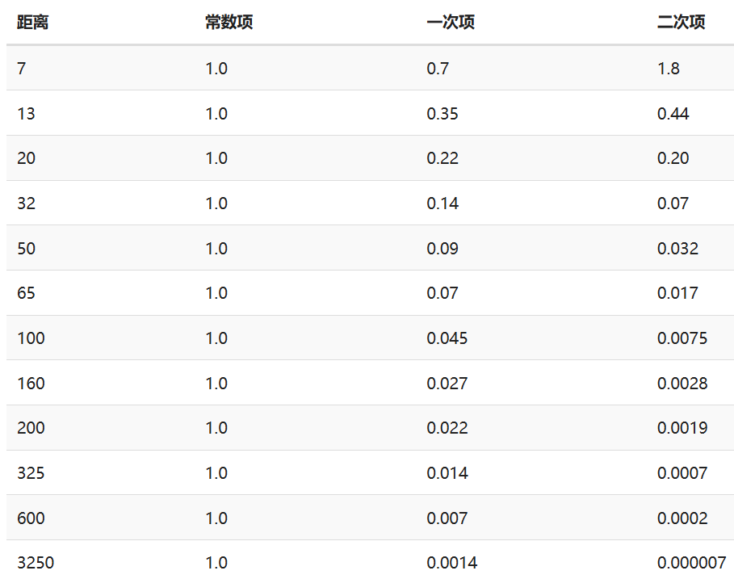

# 颜色  
物体颜色\*光线颜色=反射颜色  
  
  
  
# 光照模型  
  
- 环境光照ambient  
	简化全局照明模型，使用一定强度的灯光（乘系数）  
- 漫反射光照diffuse  
	入射光与法线夹角大小和漫反射强度成反比  
	这里漫反射强度的变化可以理解为不同角度入射的相同密度的光束，平面接收的光的密度是不一样的  
- 镜面反射光照specular  
	反射光与视线夹角大小和镜面反射强度成反比  
  
每种光照均为颜色乘强度系数  
最终光照为三者之和  
这些在fs中操作（phong模型）由于已经插值再计算，效果更真实；如果在vs操作（Gouraud模型），对顶点计算然后进入fs插值，计算量小但较假  
  
# 物体光线渲染  
  
- 材质  
  1. ambient 环境光照反射颜色，通常为物体表面颜色  
    diffuse 漫反射颜色同上  
    specular 镜面反射（镜面高光）颜色  
 2. shininess 镜面高光散射半径，也称反光度，与反射强度正相关，与散射半径负相关；通常为$2^n$  
- 光源  
  1. ambient 强度通常较低，避免环境光颜色过于影响物体颜色  
    diffuse 强度较强，对应光线颜色  
    specular 强度一般拉满，保持白光  
  2. position （点光源）光源位置，用于计算入射光方向  
  3. direction（平行光/聚光）方向  
  4. constant $F_{att}$常数项  
    linear $F_{att}$一次项  
    quadratic $F_{att}$二次项  
  5.  cutOff （聚光）聚光半径的切光角（Phi$\Phi$），限定聚光范围锥体  
  
上述均作为结构体，具有三种光照分量，表示对应光线颜色；结构体分量仍然要单独设置  
  
# 光源  
- 点光源  
- 平行光  
	  
- 聚光  
	  
	LightDir：片段->光源  
	SpotDir：聚光指向  
	计算$\Theta$（LightDir和SpotDir夹角），和$\Phi$比较大小以判断是否在聚光照射范围  
  
  
  
# 计算流程  
处理坐标时会统一在某一坐标下，一般是在观察坐标（可以直接获取观察位置，即原点），也可在世界坐标。二者都需要相应矩阵  
第四位（w分量，类比xyz）表示位移效果，不希望有位移的量，如法线方向、平行光方向等该位置零，可以由此检测向量性质  
- 位置  
  - 片段位置：vs计算片段在计算坐标的位置（model矩阵）  
  - 观察位置（view）：使用世界坐标计算时需要计算该位置  
  
- 方向  
	方向由位置计算  
  - 法线（normal）：可以预先写入，也可以向量叉乘计算，由vs传入fs。注意转换为计算坐标，为法线单独处理model矩阵即法线矩阵，对model求逆再转置，mat3(transpose(inverse(model)))，注意通常使用四维坐标，而法向量是三维，可以添加四维0，或者model强转mat3（如上）  
  - 视线：由观察位置计算得到  
  - 光线：注意方向问题，提供的计算函数一般接受光线方向（光源->物体），可以通过取反解决  
  方向类一般都会标准化，便于点乘计算角度（arccos），注意角度cos要保证为正（作系数的要求）。标准化函数保留正负  
  
- 距离  
  - 衰减量：  

    $$F_{att}=\frac{1.0}{K_c+K_l*d+K_q*d^2}$$  
    常数项通常保持为1.0，它的主要作用是保证分母永远不会比1小，否则的话在某些距离上它反而会增加强度。  
    一次项会与距离值相乘，以线性的方式减少强度。  
    二次项会与距离的平方相乘，让光源以二次递减的方式减少强度。二次项在距离比较小的时候影响会比一次项小很多，但当距离值比较大的时候它就会比一次项更大了。  
    这些取值通常取决于距离，参考<https://wiki.ogre3d.org>  
      
	由位置和light的分量计算出衰减量  
  
- 综合  
  - 环境光照：光分量\*材质分量\*衰减量  
  - 漫反射光照：光分量\*材质分量\*角度强度\*衰减量，角度为入射和法线角度  
  - 镜面反射光照：光分量\*材质分量\*反光度强度\*衰减量；反光度反光度强度是反射光和视线夹角的反光度次幂  
  - 三者相加，加上第四位数据，生成片段渲染颜色  