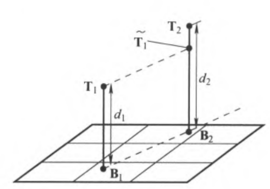

## 摄像机对各种几何的作用  
#### 平面  
对任意平面$\pi$，令其为世界坐标系的XY平面，则$\pi$上一点X映射到像平面的点x为  
$$x = PX = [p_1 \, p_2 \, p_3 \, p_4] \begin{pmatrix} X \\ Y \\ 0 \\ 1 \end{pmatrix} = [p_1 \, p_2 \, p_4] \begin{pmatrix} X \\ Y \\ 1 \end{pmatrix}=H\begin{pmatrix} X \\ Y \\ 1 \end{pmatrix}$$  
H为P的1‘2’4列，即$\pi$上点$x_{\pi}$到像平面上点x的映射为3\*3射影变换H，$x = H x_{\pi}$  
  
在透视影像下，一张场景平面与一张图像平面之间最一般的变换是平面射影变换  
更一般的，有**同一物体在不同平面由同一摄像机投影得到的像相差一个平面射影变换**  
  
仿射摄像机时，该射影变换为仿射变换  
  
#### 直线  
- 正向投影  
	空间中一条直线与光心所在平面交像平面于直线的投影  
- 反向投影  
	平面上一条直线反向投影至该直线与光心所在平面  
	平面直线l，摄像机矩阵P，映射平面为$P^Tl$  
	（令X的投影PX在l上，X在映射得到的平面上，可证得上结论）  
-  Plücker 相关 #todo p169-170  
  
#### 二次曲线  
在摄像机 $P$ 作用下，二次曲线 $C$ 反向投影成锥面$$Q_{co} = P^T CP$$$Q_{co}$ 4\*4且不满秩，光心为锥面顶点且为$Q_{co}$零向量  
证明同理直线的反向投影  
  
  
#### 光滑曲面  
轮廓生成元 $\Gamma$ 是影像射线与曲面 $S$ 的所有切点 $X$ 构成的集合  
对应的图像视在轮廓线 $\gamma$ 是 $X$ 的图像点 $x$ 构成的集合，即 $\gamma$ 是 $\Gamma$ 的图像  
视在轮廓线/外形线/轮廓  
  
#### 二次曲面  
- 外形线&图像  
	摄像机P，二次曲面Q，有$$C^* = PQ^*P^T$$Q的外形线二次曲线C由此确定  
	（证明：C的每条切线的反向投影平面为Q的切平面）  
	同时得到的$C^*$是Q的图像，即二次曲面的图像与外形线是对偶关系。  
	两条二次曲线分别是投影点的集合和投影点处切线的集合。  
- 轮廓生成元的平面  
	与二次曲面 $Q$ 和中心为$\mathbf{C}$的摄像机相对应的轮廓生成元 $\Gamma$ 的平面是 $\pi_{\Gamma} = Q\mathbf{C}$  
	#todo 证明（参考点与二次曲面的极点极线）  
- 影像射线组成的锥面（射线锥）  
	顶点为 $V$ 并与二次曲面 $Q$ 相切的锥面是一个退化的二次曲面 $$Q_{CO} = (V^T QV)Q - (QV)(QV)^T$$  
	$Q_{CO}V = 0$，因而 $V$ 为锥面的顶点  
  
  
## 光心与像平面移动的效果  
固定光心而移动像平面的变化  
此处假设$P = K[I|0]$且光心不在像平面上  
三次点X，主点$x_0$，加波浪号为非齐次点  
$x = K[I|0]X$  
#### 移动像平面  
像平面沿着主轴移动，等价于改变焦距，即改变K  
$x' = K'[I|0]X = K'K^{-1}(K[I|0]X) = K'K^{-1}x=Hx$  
  
$$H=K'K^{-1} = \begin{bmatrix} kI & (1-k) \tilde{x}_0 \\ 0^T & 1 \end{bmatrix}$$  
  
$k = f'/f$是放大因子  
  
$$K' = \begin{bmatrix} kI & (1 - k) \tilde{x}_0 \\ 0^T & 1 \end{bmatrix} K = \begin{bmatrix} kI & (1 - k) \tilde{x}_0 \\ 0^T & 1 \end{bmatrix} \begin{bmatrix} A & \tilde{x}_0 \\ 0^T & 1 \end{bmatrix} = \begin{bmatrix} kA & \tilde{x}_0 \\ 0^T & 1 \end{bmatrix} = K \begin{bmatrix} kI & 0 \\ 0^T & 1 \end{bmatrix}$$  
  
#### 旋转摄像机  
仅旋转  
$x' = K[R|0]X = KRK^{-1}K[I|0]X = KRK^{-1}x=Hx$  
$$H = KRK^{-1}$$  
H为单应旋转 #todo A7.1  
H与R的3个特征值相同，视图之间的旋转角可以由H的复特征值的相位求出 #todo   
H特征值对应的特征向量是旋转轴的消影点 #todo  
  
**摄像机中心位置相同的摄像机的所有图像射影等价**  
#### 移动摄像机中心  
摄像机中心不动，而只移动像平面，无法获得任何三维信息：参考包围盒贴图这种情况  
  
- 视差：  
	摄像机中心在$C_1$时，两空间点的像重合  
	摄像机中心在$C_2$时，两空间点的像不重合，像距离为视差  
  
  
## 已标定摄像机  
此处均考虑欧式坐标系。  
已标定摄像机，即已知K时有哪些可定关系。  
  
#### 像点x与反向投影射线（方向为d）关系  
$P = K[I|0]$，此时摄像机中心在原点  
图像射线方向记为d，射线上一点为$\tilde{X} = \lambda d$，该点被映射为$x = K[1 | 0] (\lambda d^T, 1)^T = Kd$（差一个尺度因子）  
即标定矩阵K为像点x与摄像机欧式坐标系下射线方向$d = K^{-1}x$之间的仿射变换  
  
#### 像直线与反向投影平面关系  
类似有：反向投影平面，即像直线与光心确定的平面。该平面法向量n与直线l的关系为$n = K^T l$  
  
#### 夹角与两个像点关系  
$$\cos\theta = \frac{d_1^T d_2}{\sqrt{d_1^T d_1} \sqrt{d_2^T d_2}} = \frac{x_1^T (K^{-T} K^{-1}) x_2}{\sqrt{x_1^T (K^{-T} K^{-1}) x_1} \sqrt{x_2^T (K^{-T} K^{-1}) x_2}}$$  
即已知两像点即可求夹角。  
也即：$$\cos \theta = \frac{\mathbf{x}_1^T \omega \mathbf{x}_2}{\sqrt{\mathbf{x}_1^T \omega \mathbf{x}_1 \cdot \mathbf{x}_2^T \omega \mathbf{x}_2}}$$  
对比$$\cos \theta = \frac{l^T C_{\infty}^* m}{\sqrt{(l^T C_{\infty}^*l) (m^T C_{\infty}^* m)}}$$  
可以视作一种对偶定理：线夹角计算使用的$C_{\infty}^*$是一种退化的点二次曲线，而点夹角计算使用的$\omega$是一种非退化的对偶二次曲线（线二次曲线）。  
同理，这也是射影不变的计算方式。  
由此有正交方向的两点关系：$\mathbf{x}_1^T \omega \mathbf{x}_2 = 0$  
  
  
## 绝对二次曲线图像（IAC）/对偶图像（DIAC）与标定  
#### 无穷远平面的映射  
$\pi_{\infty}$ 上的点$X_{\infty} = (d^T, 0)^T$  
有一般摄像机 $P = KR [I \mid -\tilde{C}]$，则像点为  
$$x = P X_{\infty} = KR [I \mid -\tilde{C}] \begin{pmatrix} d \\ 0 \end{pmatrix} = KR d$$  
即$\pi_{\infty}$与像平面的映射为单应矩阵H=KR  
  
#### IAC与DIAC映射  
绝对二次曲线$\Omega_{\infty}$映射为二次曲线$\omega = (KK^T)^{-1} = K^{-T} K^{-1}$即IAC。  
则IAC仅与内参相关  
同理有绝对二次曲线对偶图像DIAC：$\omega^* = \omega^{-1} = KK^T$  
DIAC为绝对对偶二次曲面的图像，所以也有$\omega^* = PQ_\infty^* P^T$  
  
#### 用于标定  
由此$\omega$&$\omega^*$可以Cholesky分解确定K，K也可以求出这两个线。  
平面 $\pi$ 与 $\pi_\omega$ 相交于一条直线,而这条直线与 $\Omega_\omega$ 相交于 $\pi$ 上的两个虚圆点。虚圆点的图像在 $\omega$ 上,并且是平面 $\pi$ 的消影线与 $\omega$ 的交点。  
（一个简单多图标定：由对应点求H，由多个H求多组虚圆点，由虚圆点拟合$\omega$，分解得K）  
  
#### 正交性  
点x反向投影的射线与直线l反向投影的平面正交时，有$l=\omega x$，同时也是极点-极线关系  
反向投影射线正交的两点有，$\mathbf{x}_1^T \omega \mathbf{x}_2 = 0$，同时也是关于$\omega$共轭的关系  
反向投影平面垂直的两直线满足 $l_1^T \omega^*l_2 = 0$  
  
## 消影点与消影线  
#### 消影点  
直线l的方向为d，线上一点A，则参数化为$X(\lambda) = A + \lambda D$，$D = (d^T, 0)^T$  
$\lambda \to \infty$时，$X(\lambda)$即为无穷远点$X_\infty=D$  
无穷远点的映射，即该直线交像平面的点，即消影点$v = PX_\infty = K[I|0] \begin{pmatrix} d \\ 0 \end{pmatrix} = Kd$  
由上式可得无穷远点只与场景有关，消影点与旋转有关而与中心位置无关  
由此可以约束求得旋转矩阵R  
  
消影点同样是像点，所以也可以代入$\cos \theta = \frac{\mathbf{x}_1^T \omega \mathbf{x}_2}{\sqrt{\mathbf{x}_1^T \omega \mathbf{x}_1 \cdot \mathbf{x}_2^T \omega \mathbf{x}_2}}$求两直线夹角  
#### 消影线  
平面法向量n与直线l的关系为$n = K^T l$  
当已知消影线时，代入可得平面方向  
同消影点，可求得R与夹角  
  
消影线可以由两个消影点确定，也可以由平行线确定  
  
由等距平行线求消影线：  
$(a,b,c)$表示$ax+by+c=0$时，平面上一组直线为$l_n' = (a, b, n)^T = (a, b, 0)^T + n(0, 0, 1)^T$  
若有等距线$l_0, l_1$ 和 $l_2$，则有闭形式解（即解析解）  
$$ l= ((l_0 \times l_2)^T(l_1 \times l_2))l_1 + 2((l_0 \times l_1)^T(l_2 \times l_1))l_2$$  
#todo 为什么不直接做差 p185  
#### 消影点与消影线的正交关系  
参考IAC部分的正交性，消影点与消影线代入即可  
  
  
## 仿射3D测量与重构  
设场景平面为地平面，其消影线为地平线，其法向为垂直方向，法向消影点为竖直消影点  
#### 平行线的相对长度测量  
设两线$L_1$$L_2$均为垂直方向  
有过$T_1B_1$的直线$L_1$，过$T_2B_2$的$L_2$，$B_1$$B_2$在地平面上  
映射到像平面上过$t_1b_1$的$l_1$，过$t_2b_2$的$l_1$  
已知地平线l和竖直消影点v，可求$T_1B_1$与$T_2B_2$的长度比  
  
算法：  
- 消影点：由$b_1b_2$交消影线l可得消影点$\mathbf{u} = (\mathbf{b_1} \times \mathbf{b_2}) \times \mathbf{l}$  
- 转移点：$\mathbf{t_1b_1}$转移到$\mathbf{t_2b_2}$时，变为$\mathbf{\tilde{t_1}b_2}$；$\mathbf{t_1\tilde{t_1}}$平行于$\mathbf{b_1b_2}$，所以$t_1\tilde{t_1}$过消影点；即$t_1 u$连线交$t_2b_2$为$\mathbf{\tilde{t}_1} = (\mathbf{t_1} \times \mathbf{u_2}) \times( \mathbf{v} \times \mathbf{b_2})$  
- 获取像长度：将$l_2$上四点 $\mathbf{b_2}, \mathbf{\tilde{t}_1}, \mathbf{t_2},\mathbf{v}$按到 $\mathbf{b_2}$ 的距离重新表示为 $0, \tilde{t}_1, t_2$ 和 $v$  
- 恢复仿射长度的映射：求将消影点 $v$ 映射到无穷远点的射影变换H，可以计算映射齐次坐标 $(0, 1) \mapsto (0, 1)$ 和 $(v, 1) \mapsto (1, 0)$ 的射影变换 $H_{2 \times 2}$。一个合适的矩阵是  
  
$$H_{2 \times 2} =\begin{bmatrix}1 & 0 \\1 & -v\end{bmatrix}$$  
  
- 长度比：$$\frac{d_1}{d_2} = \frac{H_{2 \times 2} (\mathbf{\tilde{t}_1}, 1)^T}{H_{2 \times 2} (\mathbf{t_2}, 1)^T}=\frac{\tilde{t}_1 (v - t_2)}{t_2 (v - \tilde{t}_1)}$$  
#todo p188 t_2为什么带波浪号  
  
  
  
## 单视图确定标定K  
#### 确定$\omega$后求K  
$\omega$线性约束来源：  
- 竖直消影点/消影线$\mathbf{v}_1^T \omega \mathbf{v}_2 = 0$，$l_1^T \omega^*l_2 = 0$，1个约束  
- $l=\omega x$即$l\times \omega x=0$，2个约束  
- 由对应点求H，由多个H求多组虚圆点，由虚圆点拟合$\omega$：$H = [h_1, h_2, h_3]$，虚圆点为$(1, \pm i, 0)^T$，$H (1, \pm i, 0)^T$在$\omega$上，即$(h_1 \pm i h_2)^T \omega (h_1 \pm i h_2) = 0$，即$h_1^T \omega h_2 = 0$和$h_1^T \omega h_1 = h_2^T \omega h_2$，2个约束  
- K已知以下特性时：若$s = K_{12} = 0$，那么 $\omega_{12} = \omega_{21} = 0$。若还有 $\alpha_x = K_{11} = K_{22} = \alpha_y$，那么 $\omega_{11} = \omega_{22}$，1+2个约束  
通过向量化$\omega$，约束整合为$\mathbf{a}^T \mathbf{w} = 0$，进而组成方程组$\mathbf{A}\mathbf{w} = 0$，A为n个约束的$n \times 6$矩阵  
SVD解出$\mathbf{w}$即$\omega$，Cholesky分解得K  
  
$\omega=(KK^T)^{-1}$，所以自由度等于K自由度，即5（或者：$\omega$显然是对称矩阵）  
超定时可以参数化$\omega$并硬约束其某些值为0  
噪声多时选用软约束  
  
#### 约束的几何  
上述约束几何上分为两点在$\omega$上，或两点关于$\omega$共轭  
  
## 标定二次曲线  
用以可视化K  
顶角为45°而轴为摄像机主轴的圆锥面的图像  
与摄像机相对静止，不妨设摄像机矩阵$P = K[I|0]$，方向z轴正向  
此时45°圆锥面的任何一点满足 $X^2 + Y^2 = Z^2$  
该圆锥面的点映射为二次曲线  
$$C = K^{-T}   
\begin{bmatrix}  
1 & 0 & 0 \\  
0 & 1 & 0 \\  
0 & 0 & -1  
\end{bmatrix}  
K^{-1}$$  
K为I时，标定二次曲线为单位圆  
否则为（旋转的）椭圆，分别交x轴、y轴于$\alpha_x$和$\alpha_y$，最高点（y最大）的x为扭曲参数s  
  
记 $C = K^{-T}DK^{-1}= (K^{-T}K^{-1})(KDK^{-1}) = \omega S$，则$S = KDK^{-1}$  
对点 $x$，乘积 $Sx$ 表示点 $x$ 关于二次曲线 $C$ 的中心（即主点）的反射点，即对称点$\dot{x}$   
从而有$x'^T \omega x = x'^T C \dot{x}$  
因此：直线l反向投影的平面若与点x反向投影射线正交，则l为x反射点$\dot{x}$的极线  